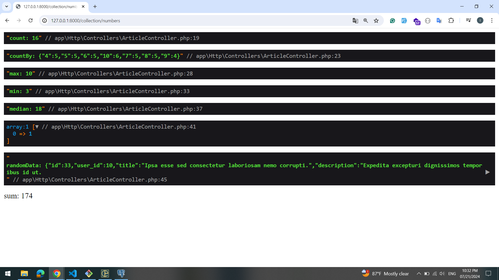

## About project

Laravel popular collection methods for junior developers. I showed some examples with collections and real examples from database eloquent (model)... You can see result of some collection methods

## concat() method

### collapse() method

## pluck() method

## contains() method

## only() method

## except() method

## numbers

## whereClauses

